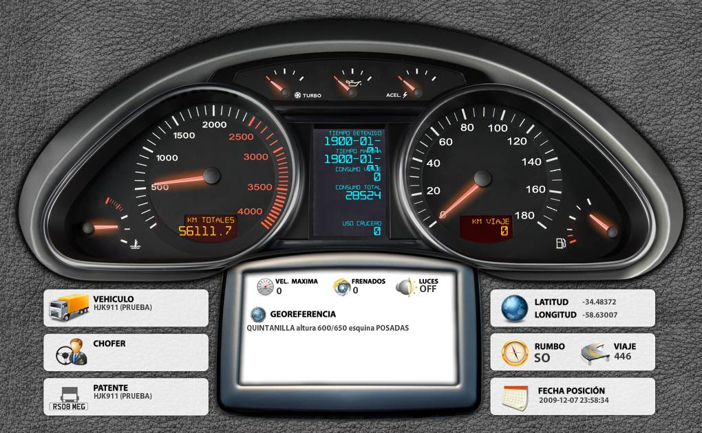

---
LoJack is a stolen vehicle :rotating_light: recovery system that is integrated with law :woman_judge::balance_scale: enforcement, enabling vehicles and equipment to be tracked and recovered by police :oncoming_police_car::police_officer:  
You can read more in [Wikipedia](https://en.wikipedia.org/wiki/LoJack)  

### What about this project?
The GPS :artificial_satellite: tracking devices installed in trucks :truck: send data in real time to Lojack servers :satellite:.  
**This project is the UI Dashboard** :iphone: that present vehicle data like speed, RPM, Geolocation, etc.  
This project was originally created in 2009 with technologies used at the time :older_man:
[Here is the original sources](/legacy)  
We will make a full refactor :recycle: using nowdays tech stack.

### Expired Tech Stack :coffin:

* **JQuery**: Fast, small, and feature-rich JavaScript library
* **sIFR**: Replace text elements on screen with Flash equivalents
* **Fusion Charts**: ~~JavaScript~~ Flash charts for web and mobile apps

### New Tech Stack :rocket:

* **VueJS:** The Progressive JavaScript Framework.
* **Vuex:** Vuex is a state management pattern + library for Vue.js applications.
* **Vue-router:** Vue Router is the official router for Vue.js.
* **SASS:** CSS with superpowers.
* **Serverless Framework:** Serverless, Simplified.

### How did it look :eyes:?

